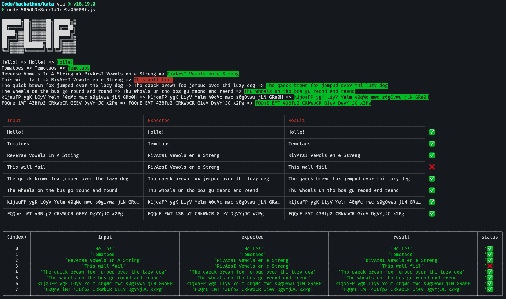

# Reverse Vowels In A String

Challenge: [https://www.codewars.com/kata/585db3e8eec141ce9a00008f](https://www.codewars.com/kata/585db3e8eec141ce9a00008f)

In this kata, your goal is to write a function which will reverse the vowels in a string. Any characters which are not vowels should remain in their original position. Here are some examples:

```
"Hello!" => "Holle!"
"Tomatoes" => "Temotaos"
"Reverse Vowels In A String" => "RivArsI Vewols en e Streng"
```

For simplicity, you can treat the letter y as a consonant, not a vowel.

## Solution



## Best Solution

```
const reverseVowels = str => {
  let vowels = str.replace(/[^aeiou]/gi, '').split('');
  return str.replace(/[aeiou]/gi, _ => vowels.pop());
};
```
